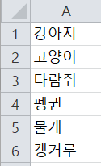
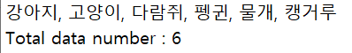
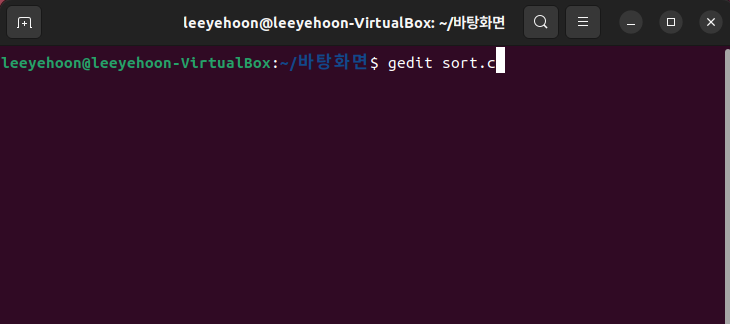
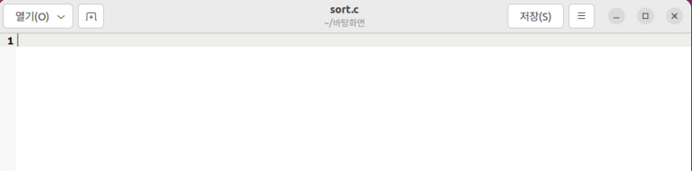
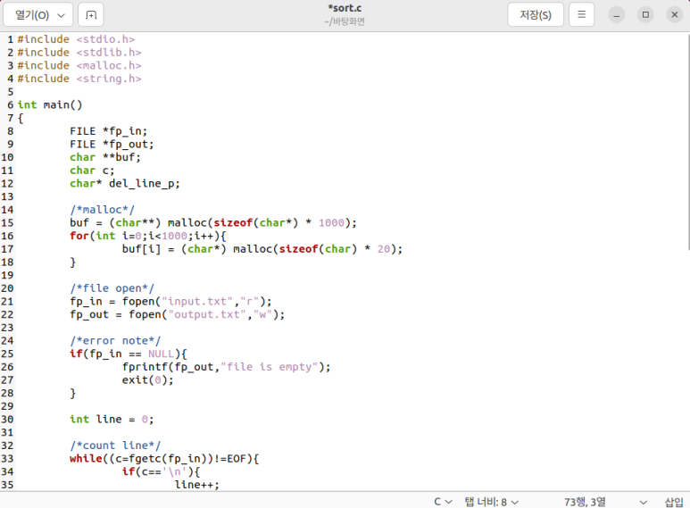
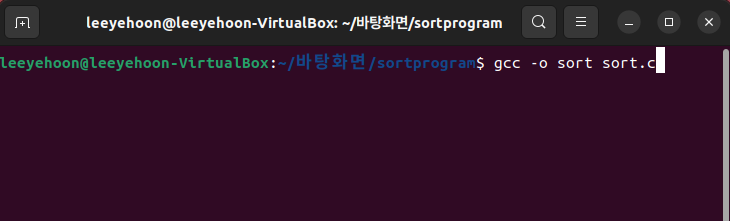
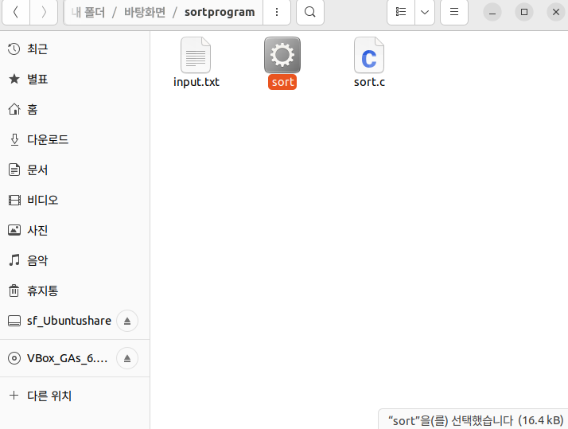
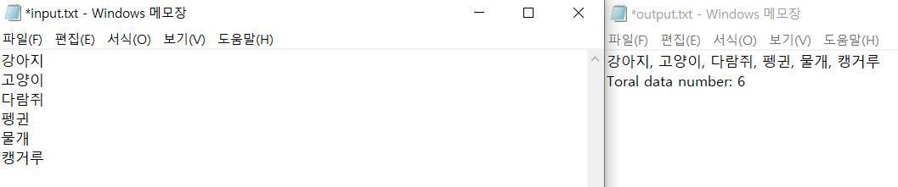

# Text Editor

어느 날 여자친구가 문서 작업을 하는 모습을 보았는데,,

엑셀에 n행 1열로 나열된 데이터를 하나씩 가로로 정렬하는 모습을 보니, 데이터가 많아서 힘들어 보였습니다.

​

그래서 프로그램을 만들어 줘야겠다고 결심했습니다 ㅎㅎㅎㅎ(여자친구가 힘들어 보이기보다는 멋져 보이고 싶어서...)

​

개발하고자 하는 프로그램을 자세히 설명드리자면,

  
   
  행 데이터

  
   
  가로 정렬된 데이터

- 위와 같이 행 데이터가 6개 있다고 하면, 6개의 데이터를 가로로 정렬된 텍스트 데이터로 출력해 주고, 데이터의 수도 알려주는 프로그램입니다.

## 프로그램을 개발한 환경

저는 Linux 운영체제 안에서 gedit이라는 텍스트 편집기를 이용해서 프로그래밍을 했습니다.

Linux를 선택한 이유는 이렇습니다.
1.  오픈소스 기반 운영체제이기 때문에 누구나 쉽게 사용할 수 있다.
2. 컴퓨터의 자원과 주변 장치까지도 프로그래밍 할 때, 동일하게 파일의 형태로 인식하여 접근하기 쉽다.
3. 다양한 플랫폼에 쉽게 이식할 수 있도록 C언어로 작성되어 있다.

gedit이라는 텍스트 편집기는 GNOME 데스크톱 환경, MS 윈도우, 맥 OS X 용으로 개발된 문서 편집기로서 일반적인 텍스트뿐만 아니라 프로그램 코드, 마크업 언어와 같은 구조화된 텍스트 문서를 편집하는 용도로 적합하기 때문에 선택했습니다.

## gedit 편집기

코드를 작성하기 위해서 먼저 원하는 디렉터리 터미널에서 gedit 편집기를 실행합니다. 실행하는 방법은 다음과 같습니다.

  
   
  $ gedit [파일이름]

  
   
  gedit 실행 화면

gedit은 코딩하기에 편리하게 하이라이트 기능을 제공합니다.
편집기 화면 우측 상단에 '三' 버튼을 클릭 후, 보기 → 강조 모드 → C언어 선택을 하게 되면,

  
   
  C언어 하이라이트 모드

다음과 같이 특정 문자나 함수에 하이라이트가 되어 있는 것을 볼 수 있습니다.

## 프로그램 Logic

이 프로그램의 로직은 다음과 같습니다.

1. 행 데이터를 입력받을 텍스트 파일 Input.txt을 생성한다.
2. 프로그램 안에서 Input.txt를 불러온다.
3. Input.txt의 데이터를 읽고, 한 줄씩 이차원 배열 buffer에 저장한다.
4. buffer의 내용을 output.txt에 데이터를 data'1', data'2', ... data'n' 형식으로 출력한다.

## GCC 컴파일러

작성한 코드를 컴파일 및 실행파일을 만들어주기 위해서 gcc 컴파일러를 사용합니다.
gcc 컴파일러는 여러 옵션을 가지고 컴파일을 해주며, 목적 파일, 실행파일도 만들어줍니다.
컴파일, 실행파일을 만들기 위한 방법은 다음과 같습니다.

  
   
  gcc -o [실행파일명] [컴파일할 파일명]

  
   
  sort.c의 실행파일

## 실행 화면

  
   
  실행 화면

